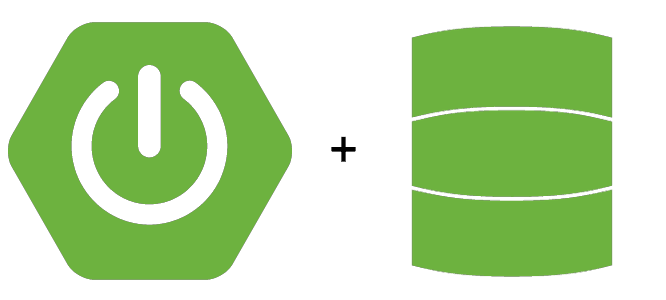

# Proyecto de Base de Datos con MongoDB y Maven

 ADONAY GONZALÉZ GUTIÉRREZ

## Índice
- [Proyecto de Base de Datos con MongoDB y Maven](#proyecto-de-base-de-datos-con-mongodb-y-maven)
  - [Índice](#índice)
  - [Introducción](#introducción)
  - [Tecnologías Utilizadas](#tecnologías-utilizadas)
  - [Metodología](#metodología)
    - [¿Qué es MVC?](#qué-es-mvc)
  - [Colecciones Utilizadas](#colecciones-utilizadas)

## Introducción
Este proyecto es una demostración de cómo utilizar MongoDB como base de datos en combinación con Maven . La aplicación se desarrolla en un entorno de desarrollo integrado (IDE) utilizando Visual Studio Code (VSCode). El propósito es mostrar la implementación de un modelo de arquitectura Modelo-Vista-Controlador (MVC) para gestionar datos relacionados con coches, personajes de League of Legends y personajes de Dragon Ball.

## Tecnologías Utilizadas
- **MongoDB**: Base de datos NoSQL utilizada para almacenar los datos del proyecto.

- **Visual Studio Code (VSCode)**: Entorno de desarrollo integrado utilizado para escribir y gestionar el código fuente del proyecto.
  

- **Spring Data**: Framework que facilita el acceso a bases de datos, integrándose con Spring Framework para proporcionar una solución robusta y fácil de usar.
  
  

## Metodología
La metodología utilizada en este proyecto es el modelo, vista y controlador (MVC).

Se utlizido spring data ya que facilita mucho la interactuacion co  la base de datos, permitiendo ser mucho mas agiles a la hora de crear cualquier tipo de CRUD, que era lo rerquerido para este trabajo.

### ¿Qué es MVC?
MVC es un patrón de diseño de software que separa una aplicación en tres componentes principales:
- **Modelo**: Representa los datos de la aplicación y las reglas de negocio. En este proyecto, el modelo se corresponde con las estructuras de datos almacenadas en MongoDB.
- **Vista**: Representa la interfaz de usuario. En este proyecto, la vista es responsable de mostrar los datos al usuario y puede ser una página web, una API REST, etc.
- **Controlador**: Gestiona la lógica de la aplicación y actúa como intermediario entre el modelo y la vista. En este proyecto, los controladores manejan las solicitudes del usuario, interactúan con el modelo para recuperar o modificar datos y actualizan la vista en consecuencia.

## Colecciones Utilizadas
El proyecto maneja las siguientes colecciones en la base de datos MongoDB:

1. **Coches**: Esta colección almacena información relacionada con diferentes coches.
2. **Personajes de League of Legends (LoL)**: Esta colección almacena información sobre los personajes del  juego League of Legends.
3. **Personajes de Dragon Ball**: Esta colección almacena información sobre los personajes del anime Dragon Ball.

Cada colección contiene documentos con estructuras específicas, adecuadas para los datos que representan. Por ejemplo, la colección de personajes de Dragon Ball incluye información sobre transformaciones, poderes y razas de cada personaje.

